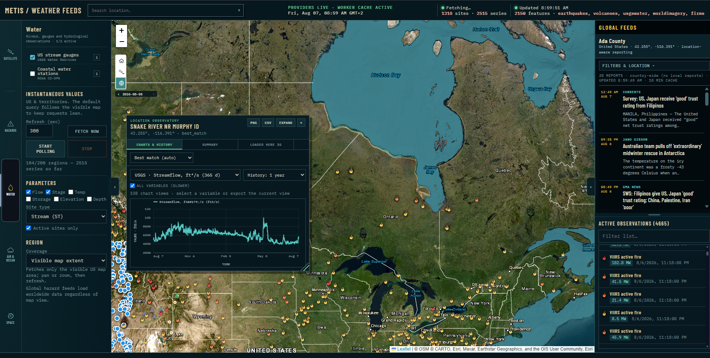
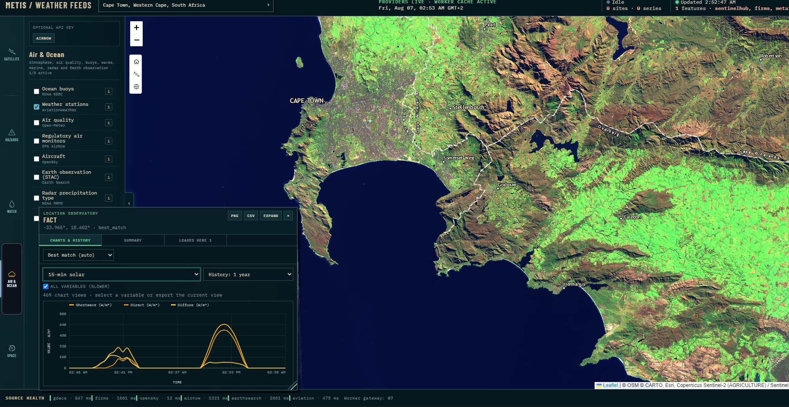
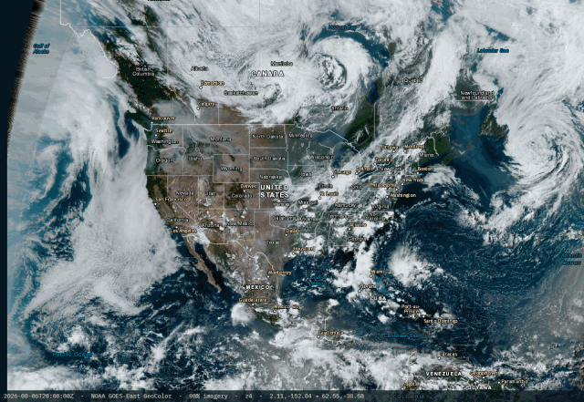
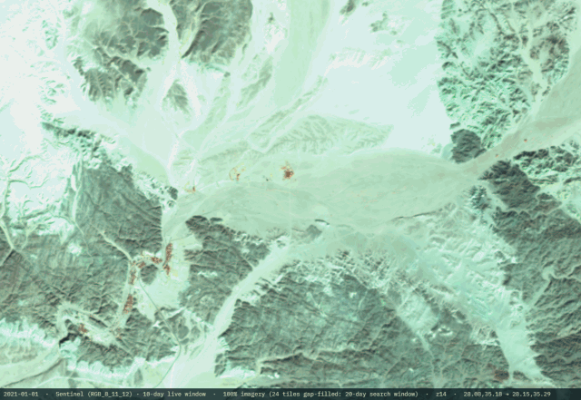
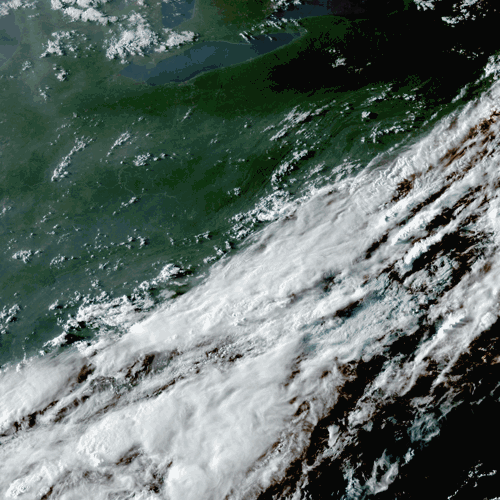
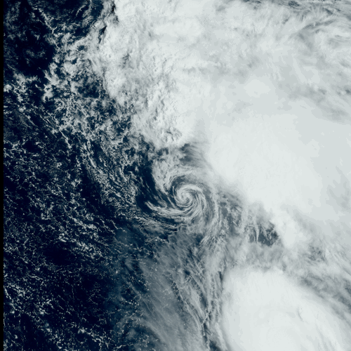
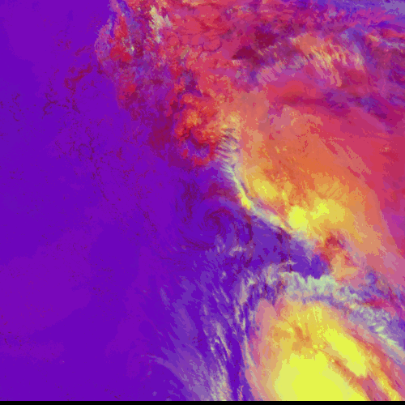
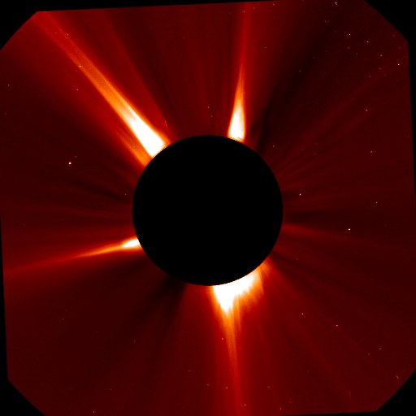
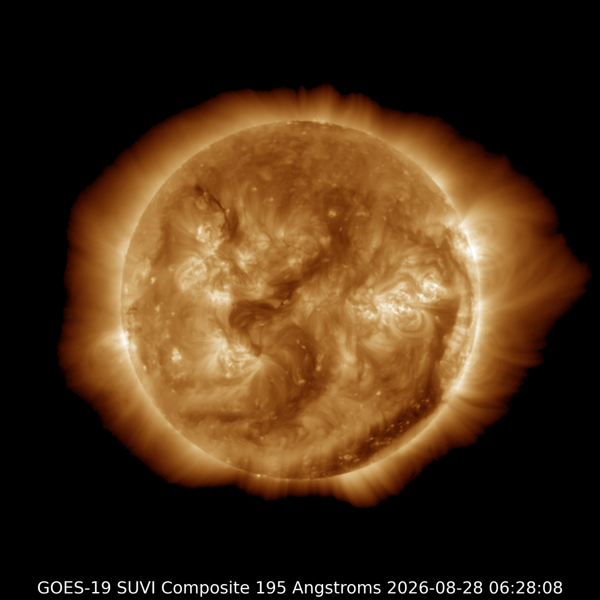

# Metis Weather Feeds

**Live dashboard:** [Try Metis Weather](https://weather.metiscore.space)

> **⚠️ The hosted versions (weather.metiscore.space) is not tied to this repo.** It's deployed straight
> from a working folder via `wrangler pages deploy`, independently of `git`/GitHub — deploying
> does not commit anything, and committing/pushing does not redeploy the site. The two can and
> do drift out of sync.

<table>
  <tr>
    <td width="33.33%"></td>
    <td width="33.33%"></td>
    <td width="33.33%"></td>
  </tr>
  <tr>
    <td width="33.33%"></td>
    <td width="33.33%"></td>
    <td width="33.33%"></td>
  </tr>
  <tr>
    <td width="33.33%"></td>
    <td width="33.33%"></td>
    <td width="33.33%"></td>
  </tr>
</table>

A single map-based weather, water and hazard observatory. The dashboard combines
live public feeds, location-aware GDELT/Currents news, comprehensive Open-Meteo
point charts, multi-provider satellite imagery playback and optional NASA
FIRMS/EPA AirNow/Sentinel Hub layers.

There is now one maintained application at `/`. The former `/global-cors/` URL
redirects to `/`; it is no longer a separate dashboard or codebase.

## What's new

- CIRA/RAMMB: every satellite, sector and band from RAMMB/CIRA SLIDER —
  GOES, Himawari, GK2A, Meteosat, JPSS. Resolution control, GIF/PNG/frame
  export. Satellite category, above Imagery date.
- More satellite bands: Meteosat/MTG — visible, shortwave IR, cloud mask,
  cloud-top height, K-index, fire. VIIRS/JPSS — product picker with night
  lights, cloud-top height, cirrus, false colour.
- Space weather imagery (LASCO, SUVI, aurora, history) now exports to GIF,
  PNG or a frame ZIP.
- Basemap switched from CARTO to Esri — faster, no key needed. Town/city
  labels are a separate layer.
- Daily satellite VIIRS product picker: SNPP/NOAA-20 get 7 bands
  (true/false colour, night lights, brightness temperature, cloud-top
  height, cirrus); NOAA-21 gets 5.
- New satellite sources: Geostationary (GOES/Himawari/Meteosat), Metop
  polar orbiters, global IR mosaic, nighttime lights.
- Space weather imagery browser: SDO, SUVI, LASCO, aurora, APOD, EPIC, TLE
  orbits, plus NOAA scales, solar wind, Kp forecast.
- Tropical cyclones: forecast/observed track and cone of uncertainty,
  colour-coded by category. One-click switch to true-colour imagery.

> The Sentinel Hub imagery uses a temporary shared key — get your own free
> instance ID at [apps.sentinel-hub.com](https://apps.sentinel-hub.com) and
> enter it in the API keys panel.

## What is included

- One responsive observatory interface with compact Water, Air & Ocean,
  Hazards, Space and Other layer groups, collapsible side panels and a unified
  map search.
- The initial map frames the contiguous United States; enabling a data layer
  fetches it immediately instead of requiring a second **Fetch now** action.
- USGS stream gauges plus global environmental, meteorological, marine, hazard
  and space feeds, including earthquakes, volcanoes, buoys, weather stations,
  water levels, air quality, radar, satellite imagery and space weather.
- A draggable and resizable location observatory. Clicking the map or choosing a
  search result opens:
  - all currently loaded observations near that point;
  - the complete Open-Meteo point chart library;
  - source history for USGS water, nearby earthquakes, NDBC buoy waves, wind,
    sea-surface temperature, air temperature and pressure, METAR,
    air quality and NOAA CO-OPS where available;
  - labelled axes, units, legends and automatic secondary axes;
  - PNG and CSV export.
- A high-contrast, newswire-style news panel with topic, keyword, language and
  time-window controls, backed by Currents API with GDELT as a keyless fallback.
  A map click resolves the nearest locality and country, then refreshes the
  news query automatically, rotating through checked topics for the tightest
  location match before widening to country- or global-scope coverage.
- Multi-provider satellite imagery playback (NASA GIBS, Esri World
  Imagery/Wayback, GOES-East/West, EOX Sentinel-2 cloud-free, Sentinel Hub)
  with gap-filled frames, GIF/PNG export and keyboard-driven scrubbing.
- Default browser-supplied keys for NASA FIRMS, EPA AirNow, Currents API and
  Sentinel Hub so every layer works immediately. Keys are stored only in that
  browser, never included in the project files or responses, and can be
  replaced or cleared per layer at any time.
- Direct NASA GIBS and NOAA MRMS map overlays, which do not consume Worker proxy
  requests.
- Bounding-box drawing remains available through the labelled Region controls;
  the redundant icon-only map toolbar has been removed.

See [SOURCES.md](SOURCES.md) for the complete source catalogue and coverage notes.

## Run locally

Python 3 is the simplest option and does not require Node.js:

```sh
python server.py
```

Then open <http://127.0.0.1:19090>. On Windows, double-click
`Start Weather Dashboard.bat`.

The local server provides the same allow-listed gateway, GDELT news route and
browser-key flow as the Cloudflare Worker. It automatically chooses another
listed port if `19090` is occupied and opens the correct URL.

## Deploy to Cloudflare

The project uses a single Cloudflare Worker for both the static site and the
small same-origin API gateway. Vercel, Pages Functions, a database and paid
Cloudflare products are not required.

```sh
npm install
npm run dev
npm run deploy
```

Use Node.js 22 or newer. Detailed setup, optional secrets and free-tier guidance
are in [WORKER_SETUP.md](WORKER_SETUP.md).

## Optional API keys

FIRMS, AirNow, Currents News and Sentinel Hub ship with site-provided default
keys so those layers work immediately with no setup. Each default is a plain
client-side value (visible in page source, like any bring-your-own-key field)
sharing one quota across every visitor — replace it with your own free key from
the layer controls if you deploy this publicly at any real scale, or if a
default key's quota is exhausted.

- [NASA FIRMS map key](https://firms.modaps.eosdis.nasa.gov/api/map_key/)
- [EPA AirNow API account](https://docs.airnowapi.org/account/request/)
- [Currents News API key](https://currentsapi.services/en/register)
- [Sentinel Hub / Copernicus Data Space instance ID](https://shapps.dataspace.copernicus.eu/dashboard/#/configurations)
  — see [SENTINEL_SETUP.md](SENTINEL_SETUP.md) for a full walkthrough from
  account creation to picking a layer.

An entered or cleared key always overrides the site default in that browser.
Do not save keys in a shared browser profile. A site owner can instead configure
Worker secrets for everyone; see [WORKER_SETUP.md](WORKER_SETUP.md).

## Worker usage model

The dashboard is designed for a small free-tier deployment:

- requests occur when a user loads a layer, searches, refreshes news or clicks a
  location; there are no background batch jobs;
- public USGS earthquake feeds load directly first, with the Worker retained as
  a fallback;
- provider responses receive short, source-appropriate edge cache lifetimes;
- GDELT news queries are cached for a short interval appropriate to interactive
  searches, with Currents retained as the optional backup path;
- reverse-geocoded location context is debounced and cached for one day;
- FIRMS and AirNow are limited to the visible map extent and cached for five
  minutes;
- GIBS satellite and MRMS radar imagery load directly in the browser;
- proxy responses are capped at 8 MiB and arbitrary target URLs are rejected.

Avoid very short auto-refresh intervals and nationwide USGS polling on a public
deployment. The default visible-map queries are intentionally conservative.

## Project structure

```text
public/                 Static dashboard and shared browser modules
worker/index.js         Cloudflare Worker gateway and static-asset entry point
server.py               Local static server and matching gateway
tests/                  Offline adapter, chart and routing tests
wrangler.toml           Cloudflare Worker/static-assets configuration
WORKER_SETUP.md         Deployment and optional-secret guide
SENTINEL_SETUP.md       Sentinel Hub account, configuration and layer guide
SOURCES.md              Providers, access modes and known coverage gaps
```

`public/globe-integration/` is a small optional adapter for consuming exported
weather GeoJSON in the separate globe project; it is not another dashboard.

## Validation

```sh
npm test
python -m py_compile server.py
npx wrangler deploy --dry-run
```

The tests are offline. They check source allow-listing, request validation,
key-handling, news-query handling, chart axes and the compatibility redirect.

## Important provider limits

- Open-Meteo's anonymous public service is intended for non-commercial use,
  limited to 10,000 calls per day and has no uptime guarantee.
- AviationWeather asks clients not to poll an endpoint more than once per minute
  per thread and applies request limits.
- FIRMS accepts regional requests only; zoom in before loading it.
- AirNow covers the United States, Canada and Mexico.
- NOAA CO-OPS uses MLLW for tidal stations and IGLD for Great Lakes stations,
  with a station-datum fallback when necessary.
- Location context uses OpenStreetMap Nominatim conservatively: user-triggered,
  debounced requests only, with attribution retained in the response.
- Model, observation, warning and satellite products have different meanings and
  update times. Keep provider and timestamp information visible when exporting.

## Licence

Project code is released under the [Apache License, Version 2.0](LICENSE.txt).
Each upstream dataset retains its own terms and attribution requirements;
review [SOURCES.md](SOURCES.md) before redistributing data or using the
dashboard commercially.
